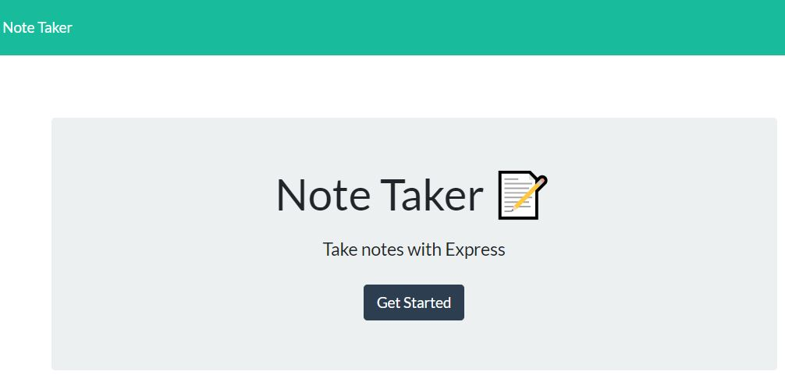
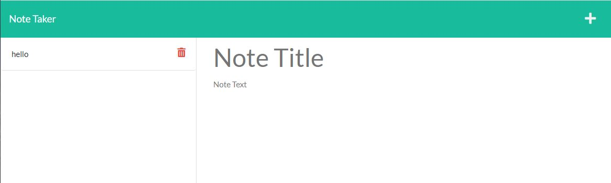
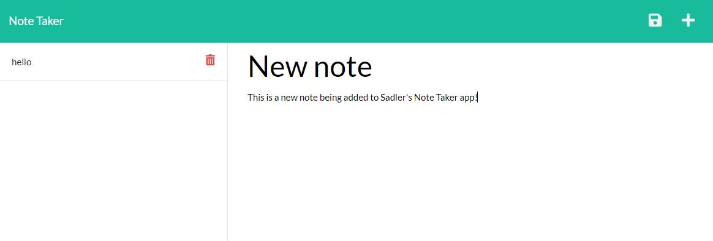
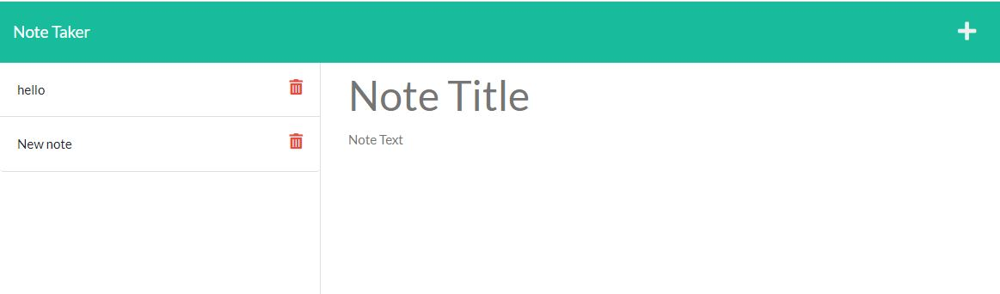
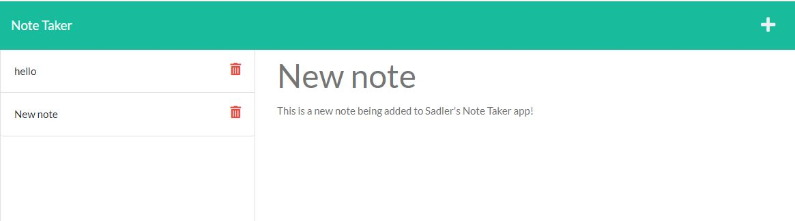

# Sadlers Note Taker

## Description
Sadler's Note Taker application can be used to write and save notes. This application will use an Express.js back end and will save and retrieve note data from a JSON file.

## Access

The URL of the GitHub repository ...

https://github.com/lynnadelesadler/Sadlers-Note-Taker

The URL of the Heroku repository ...

## Installation

- Install node.js if not already installed on your machine
- Open the `develop` folder in Integrated Terminal. 
- Run the command `npm i` to install all node files.
- once complete run the command `npm run dev` to connect to the port.

<!-- Provide the visuals for full display -->

## Usage & Visuals
- WHEN I open the Note Taker, THEN I am presented with a landing page with a link to a notes page...

- WHEN I click on the link to the notes page, THEN I am presented with a page with existing notes listed in the left-hand column, plus empty fields to enter a new note title and the note’s text in the right-hand column

- WHEN I enter a new note title and the note’s text, THEN a Save icon appears in the navigation at the top of the page

- WHEN I click on the Save icon, THEN the new note I have entered is saved and appears in the left-hand column with the other existing notes...

- WHEN I click on an existing note in the list in the left-hand column, THEN that note appears in the right-hand column...

WHEN I click on the Write icon in the navigation at the top of the page
THEN I am presented with empty fields to enter a new note title and the note’s text in the right-hand column

## Support
For help with this webpage please contact
|Name | Email |
|-----------|---------------------------|
|Lynn Sadler| lynnadelesadler@yahoo.com |

## Roadmap
Check back to this page as enhancements could be made for usability and optimized display.

## Authors and acknowledgment
Acknowledgment to Node.js, Express.js and uuid.js as this application runs off these applications.  

Startercode credit to © 2022 Trilogy Education Services, LLC, a 2U, Inc. brand. 

Primary credit to be given to Lynn Sadler for building the routes and server.js file to run the application. 

Acknowledgement to Uconn Full Stack Web Developer Bootcamp, Teachers and Teacher assistants for supporting me on my developer journey!

## License
N/A